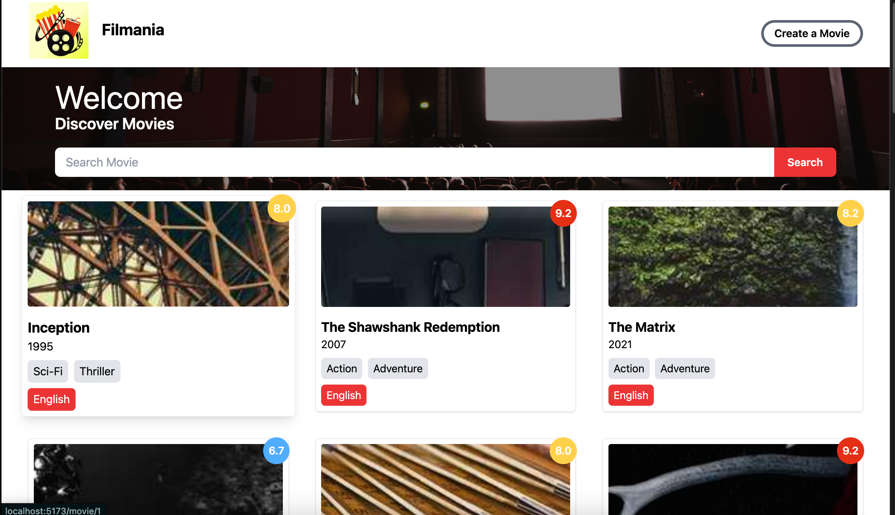
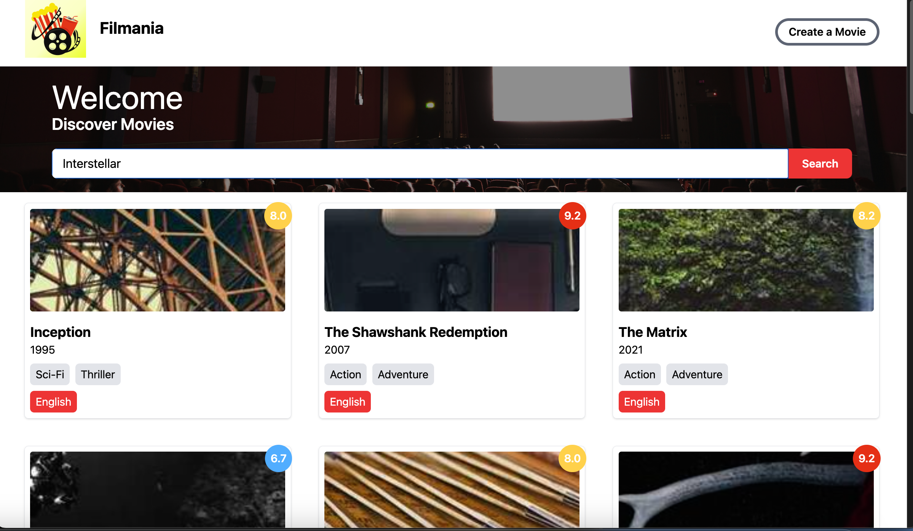
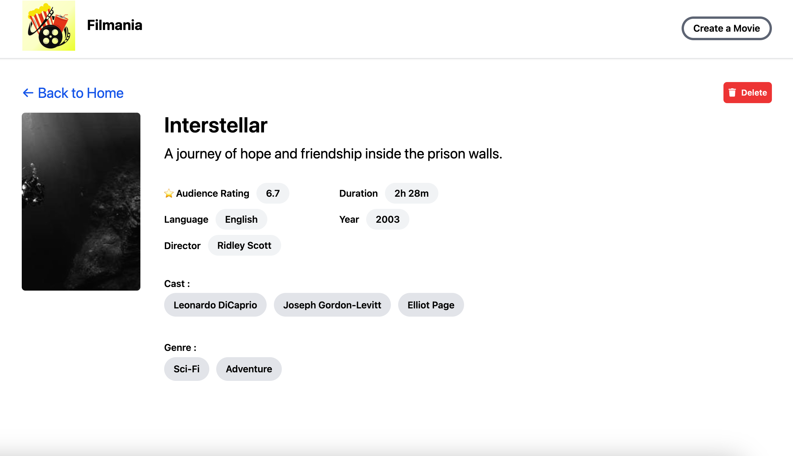
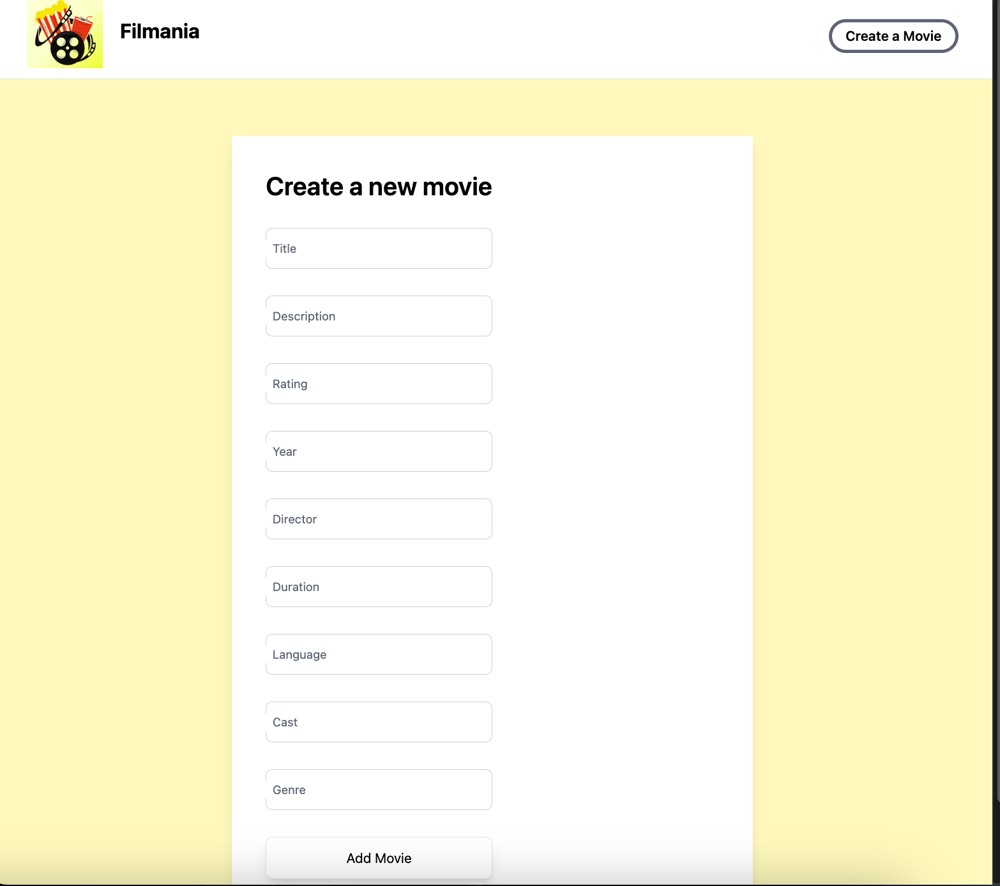

## 📌 Project Overview
Filmania is a full-stack **Node.js + React** movie application where users can:
- Browse a list of movies
- Search for movies by title
- View detailed information about each movie
- Delete movies from the list

It features a clean and responsive UI with React and TailwindCSS, and a RESTful backend built with Node.js and Express.  

## 🎬 Screenshots

### 🏠 Homepage
      

### 🔍 Search Movie
      

### 📄 Movie Detail
      

### 🗑️ Delete a Movie
       

## 🔧 Backend Technologies
- Node.js
- Express.js         

## 🔧Frontend Technologies
- react vite
- tailwind (css)
- react-router-dom
- axios
- @tanstack/react-query
- react-toastify